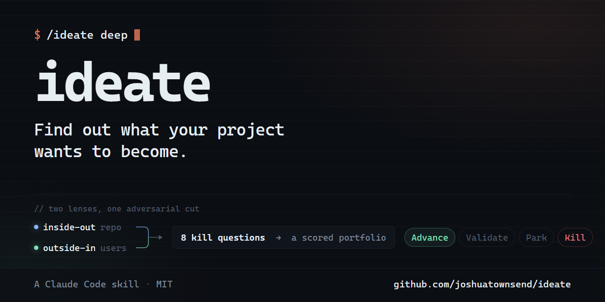

<p align="center">
  
</p>

# ideate

**Find out what your project wants to become.**

Every codebase is full of unfinished sentences: the TODO cluster nobody circled back to, the feature flag that never rolled out, the export that has no import, the plugin system that's one interface away from existing. And every project's users leave fingerprints of pain — in issue trackers, in the scripts they hand-roll around your tool, in the workaround they built at 11pm because your product almost did what they needed.

`ideate` is a [Claude Code](https://claude.com/claude-code) skill that reads both. It mines your repo for what the architecture is quietly asking for, gathers real evidence of what users actually struggle with, and turns the intersection into a scored portfolio of feature ideas — each one traceable to evidence, each one adversarially challenged before it's allowed to reach you, and each one ready to become a design brief or an executor-ready plan.

Not a brainstorm generator. A product advisor with receipts.

## Who this is for

**The solo dev, forty vibe-coded sessions deep.** You've been shipping fast — AI pair at your side, features landing daily — and somewhere around commit 400 the question quietly shifted from *"can I build this?"* to *"what should I build next?"* Here's the thing: your repo already knows. The half-built modules, the asymmetries, the thing you've hand-rolled three times that's begging to be a real capability. `ideate` reads what momentum didn't leave time to notice, and hands back grounded options instead of another blank page.

**The enterprise PM trying to remember why they loved this product.** Somewhere between quarterly planning and ticket triage, the roadmap stopped feeling like a product and started feeling like a queue. Run `/ideate deep` against the repo: real pain mined from issue trackers and support artifacts, personas rebuilt from evidence rather than slide decks, and a portfolio where every idea answers *"who wants this and why now?"* The spark tends to come back the moment you read a persona and recognize an actual human you're building for.

**The open-source maintainer with 300 open issues.** Which ten matter? `ideate` counts reactions, clusters the pain, checks what your own architecture makes disproportionately cheap, and — just as importantly — tells you what *not* to build, in writing, with reasons you can link when you close the issue.

**The team inheriting a codebase.** Nothing reveals a project's intended future like a structured read of its past. The signals playbook surfaces what the previous team started, promised, and almost built — a roadmap archaeology session in an afternoon.

## How it works

```
Phase 0-1   Recon — map the project, its users, its stated intent
Phase 2     Dual lenses, in parallel:
              inside-out  → 5 grounded signals mined from the repo itself
              outside-in  → live research, session transcripts, maintainer interview
Phase 3     Personas — synthesized from evidence, never fabricated
Phase 4     Generate wide — 2× the target count, every candidate cites evidence
Phase 5     Adversarial cut — 8 kill questions answered in writing, per candidate
Phase 6     Portfolio — scored survivors + killed/parked ledgers, saved to disk
Phase 7-8   Write-ups — design/spike briefs or full handoff plans, with kickoff prompts
```

**The inside-out lens** hunts five signal families: unfinished intent, stated-but-undelivered promises, surface asymmetries, the adjacent possible, and friction worth productizing. Its grounding rule: *a suggestion that could apply to any project in the category is noise, not a finding.*

**The outside-in lens** builds personas from real evidence — issue-tracker mining, web research, friction found in your own Claude Code session transcripts, and a three-question maintainer interview. When evidence is thin it degrades honestly (down to a disclosed inside-out-only run) rather than inventing plausible-sounding users.

**The adversarial cut** is why the output is short. Every candidate must survive eight kill questions — who uses this and how often, what outcome improves, what leverage makes it more than a wrapper, why this product and why now, what it competes with, what the smallest credible version is, which sibling idea it beats, and what you're choosing not to do instead. Every candidate exits with an explicit verdict — **Kill / Park / Validate / Advance** — and killed ideas are shown with reasons, never silently dropped.

Ideas grounded in **both** lenses — the architecture makes it cheap *and* a real user demonstrably wants it — float to the top. That intersection is the point.

## Usage

```
/ideate                     quick run (~6 ideas)
/ideate deep                live research, more subagents, wider generation (~10 ideas)
/ideate reconcile           refresh a prior portfolio against current reality
/ideate <topic>             focus ideation on a stated area
  --plans                   produce executor-ready handoff plans
  --interview               force the maintainer interview
```

## What you get

Everything lands in `ideas/` in your repo (the skill is strictly read-only on source code):

```
ideas/
  README.md                      index: portfolio, ledgers, run log — makes the
                                 next run a reconcile instead of a cold start
  001-<idea-slug>.md             design/spike brief or full handoff plan,
                                 each ending in a copy-pasteable kickoff prompt
  reports/2026-07-24-portfolio.md   the full run report, if you chose to keep it
  portfolio.html                 the review page, if you asked for one
```

- **Design/spike briefs** — a one-day investigation plan: evidence, trade-offs, open questions, decision criteria.
- **Full handoff plans** — self-contained, verification-gated implementation specs a cheaper executor model can build from with zero context.
- **The index** — persistent memory. Deferred ideas resurface; rejected ideas stay rejected; the next `/ideate` run re-scores instead of re-litigating.
- **An optional review page** — after you pick your ideas, `ideate` offers to publish the portfolio as a private, shareable web page: every idea with its verdict, score, evidence and current state, the killed and parked ledgers, and — once the write-ups land — each brief or plan with its kickoff prompt in a copy block. Decline it and nothing changes; the markdown is always written and stays the source of truth.

## Install

As a plugin (recommended):

```
/plugin marketplace add joshuatownsend/ideate
/plugin install ideate@ideate-marketplace
```

Or copy the skill directly:

```
git clone https://github.com/joshuatownsend/ideate
cp -r ideate/skills/ideate ~/.claude/skills/
```

Requires Claude Code. Deep mode benefits from `gh` (issue mining) and web access.

## Design principles

1. **Generic suggestions are noise, not findings** — every idea cites evidence from this repo or its users.
2. **Never fabricate user evidence** — degrade with disclosure instead, down to an honest inside-out-only run.
3. **Separate generation from critique** — brainstorm wide, then cut adversarially. Brainstorms without a cut pass produce flabby lists.
4. **Killed and deferred ideas are never silent** — recorded, shown, resurfaced.
5. **Strategy belongs to the maintainer** — the skill produces grounded options with honest trade-offs, not a roadmap. "Not worth building" is a valid verdict, and it says so when the evidence says so.

## Provenance

Inspired by the `next` command in [shadcn/improve](https://github.com/shadcn/improve) (inside-out signal mining, the read-only advisor pattern, executor-ready plans) and the Novel Features + user research capabilities in [mvanhorn/cli-printing-press](https://github.com/mvanhorn/cli-printing-press) (evidence-grounded personas, the adversarial cut, no-fabrication halts). Built with Claude Code, and refined by running it against its own repo — dogfood findings from real runs are what shape it.

## Contributing

Issues and PRs welcome — especially dogfood findings from real runs. If the skill produced a flabby portfolio, a confusing interaction, or a kill verdict you disagreed with, that's exactly the feedback that improves it.

## License

[MIT](LICENSE)
